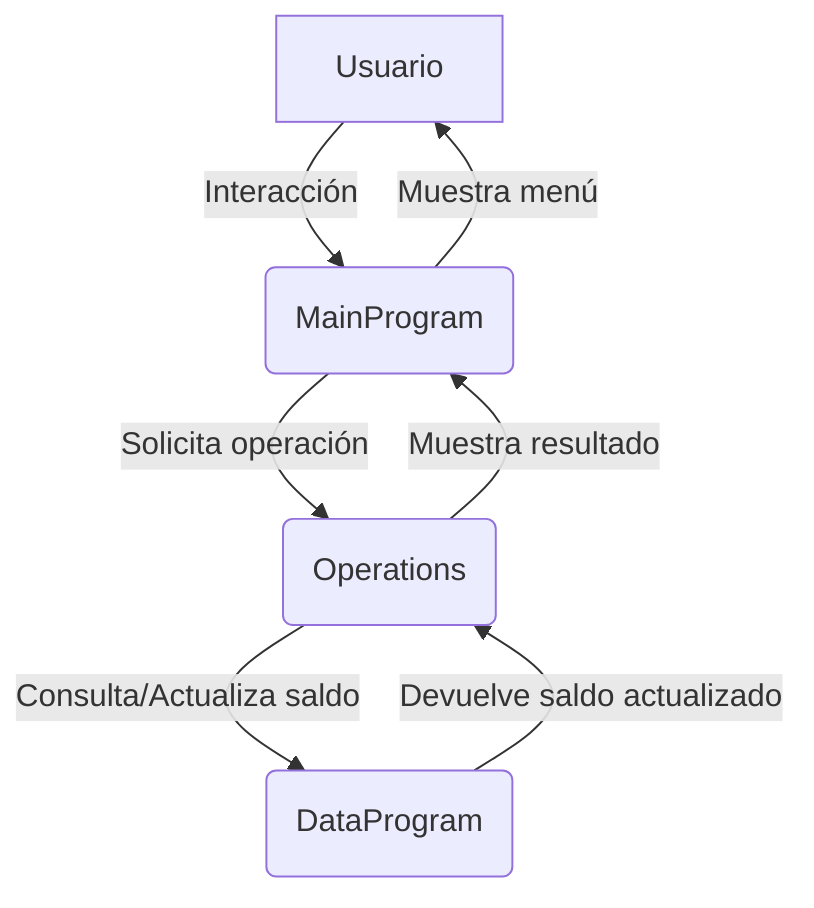

## Documentación del sistema contable escolar

### Archivo: `data.cob` (DataProgram)

Este archivo COBOL implementa el programa `DataProgram`, que actúa como el módulo de almacenamiento y gestión del saldo en el sistema contable escolar. Su función principal es mantener el valor actual del saldo de la cuenta y permitir su lectura y actualización por otros programas del sistema.

#### Estructura y funcionamiento

	- Si la operación es `'READ'`, copia el valor de `STORAGE-BALANCE` en el parámetro `BALANCE`, permitiendo que el programa llamante lea el saldo actual.
	- Si la operación es `'WRITE'`, actualiza `STORAGE-BALANCE` con el valor recibido en `BALANCE`, permitiendo que el programa llamante modifique el saldo.

Este diseño permite que otros módulos, como el de operaciones (`operations.cob`), consulten y actualicen el saldo de manera centralizada y segura, manteniendo la integridad de la información contable.

**Resumen:**
`data.cob` es el núcleo de almacenamiento del saldo en el sistema contable escolar, facilitando la lectura y escritura del saldo por otros programas mediante llamadas parametrizadas.

### Archivo: `main.cob` (MainProgram)

Este archivo COBOL implementa el programa principal del sistema contable escolar, encargado de la interacción con el usuario y la gestión del flujo del sistema.

#### Estructura y funcionamiento

- **WORKING-STORAGE SECTION**: Define las variables `USER-CHOICE` (opción elegida por el usuario) y `CONTINUE-FLAG` (bandera para continuar o salir del sistema).

- **PROCEDURE DIVISION**: Presenta un menú interactivo en consola, permitiendo al usuario:
		- Ver el saldo actual de la cuenta.
		- Realizar un crédito (abonar dinero).
		- Realizar un débito (retirar dinero).
		- Salir del sistema.

	El menú se repite hasta que el usuario elige la opción de salir. Según la opción seleccionada, se llama al programa `Operations` con el tipo de operación correspondiente (`TOTAL `, `CREDIT`, `DEBIT `). Si la opción es inválida, muestra un mensaje de error.

Este archivo es el punto de entrada del sistema contable escolar, gestionando la interacción y delegando las operaciones específicas a otros módulos.

---
**Resumen:**
`main.cob` es el controlador principal del sistema contable escolar, encargado de mostrar el menú, recibir las acciones del usuario y coordinar las operaciones sobre la cuenta.

### Archivo: `operations.cob` (Operations)

Este archivo COBOL implementa el programa encargado de realizar las operaciones sobre la cuenta del sistema contable escolar: consulta de saldo, crédito y débito.

#### Estructura y funcionamiento

- **WORKING-STORAGE SECTION**: Define variables para el tipo de operación (`OPERATION-TYPE`), el monto a acreditar o debitar (`AMOUNT`) y el saldo final (`FINAL-BALANCE`).

- **LINKAGE SECTION**: Recibe el parámetro `PASSED-OPERATION` que indica la operación solicitada.

- **PROCEDURE DIVISION**: Según el tipo de operación recibido:
	- Si la operación es `'TOTAL '`, consulta el saldo actual llamando a `DataProgram` y lo muestra al usuario.
	- Si la operación es `'CREDIT'`, solicita al usuario el monto a acreditar, consulta el saldo actual, suma el monto y actualiza el saldo llamando a `DataProgram`. Muestra el nuevo saldo.
	- Si la operación es `'DEBIT '`, solicita al usuario el monto a debitar, consulta el saldo actual y verifica si hay fondos suficientes. Si es posible, descuenta el monto y actualiza el saldo llamando a `DataProgram`. Si no hay fondos suficientes, muestra un mensaje de error.

Este módulo centraliza la lógica de las operaciones contables, asegurando que todas las modificaciones y consultas al saldo se realicen de manera controlada y validada.

---
**Resumen:**
`operations.cob` es el módulo que gestiona las operaciones de consulta, crédito y débito sobre la cuenta, interactuando con el usuario y garantizando la integridad del saldo mediante llamadas a `DataProgram`.

---

## Diagrama de flujo de datos entre módulos

**Descripción:**

- El usuario interactúa con el menú principal (`MainProgram`).
- Según la opción elegida, `MainProgram` llama a `Operations` para realizar la operación solicitada.
- `Operations` consulta o actualiza el saldo a través de `DataProgram`.
- El resultado de la operación se muestra al usuario.
